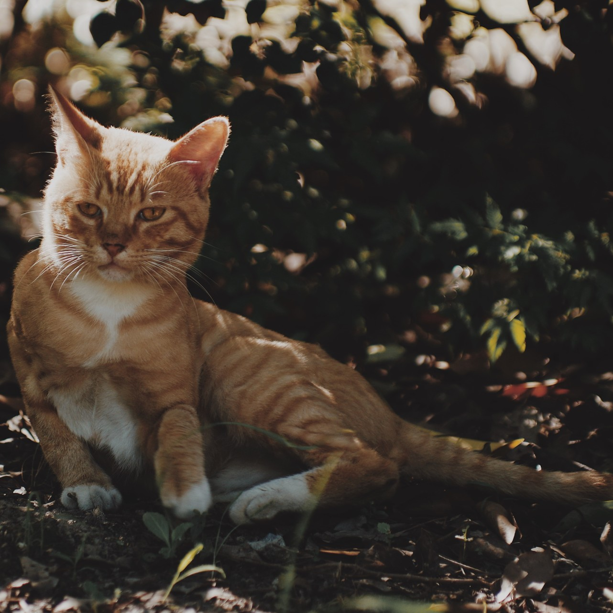
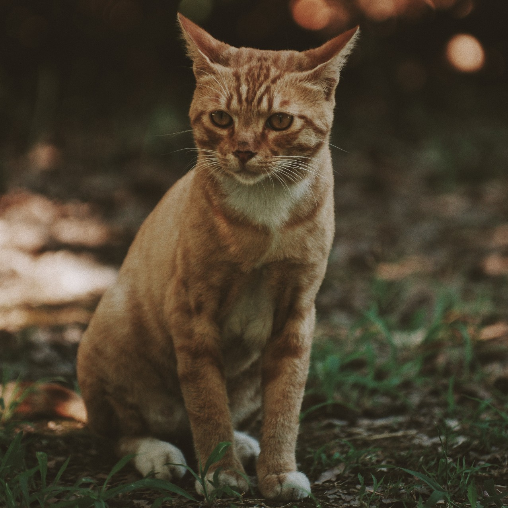
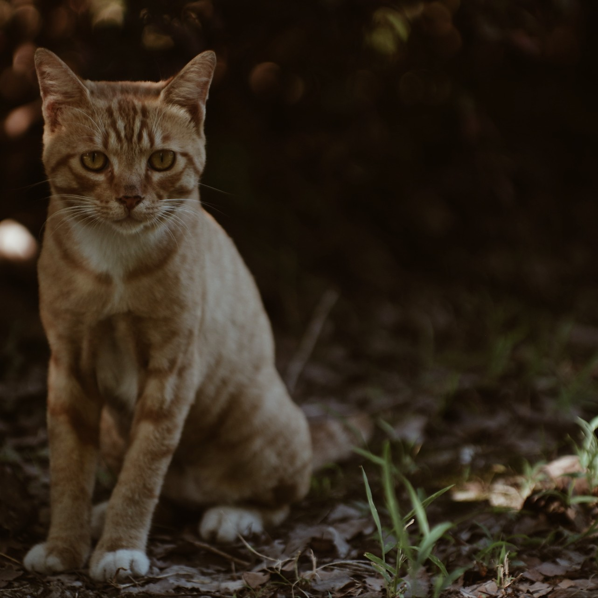
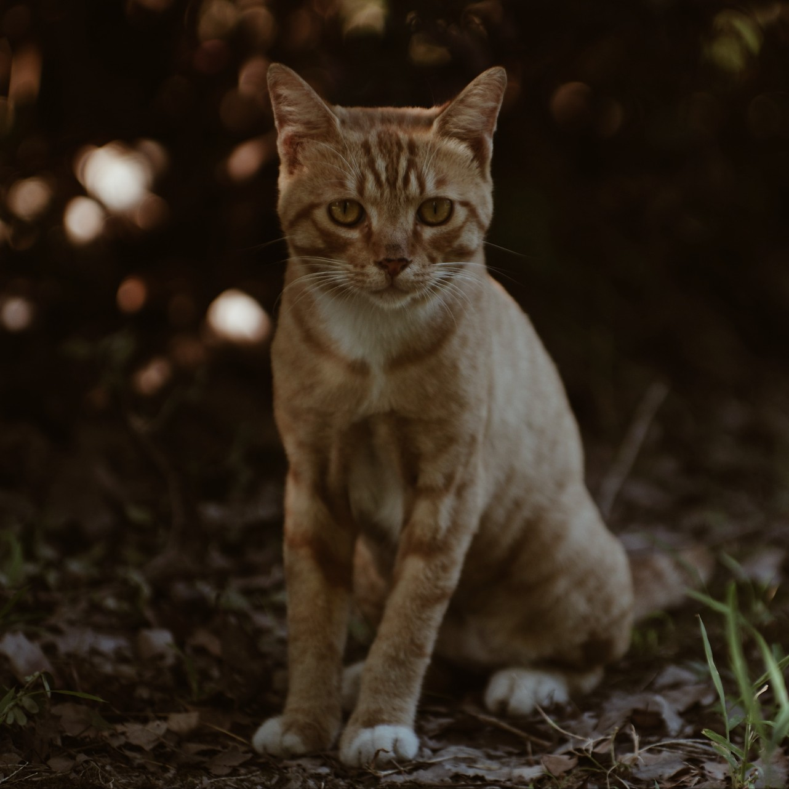
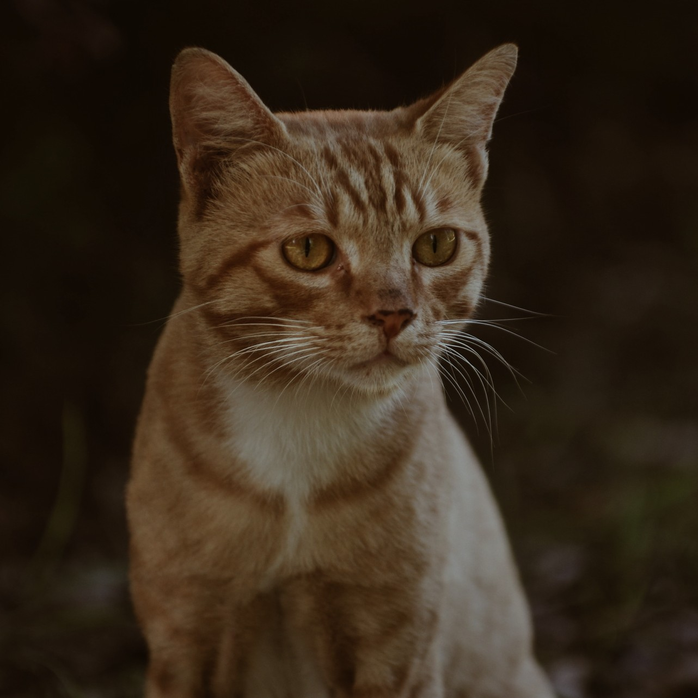
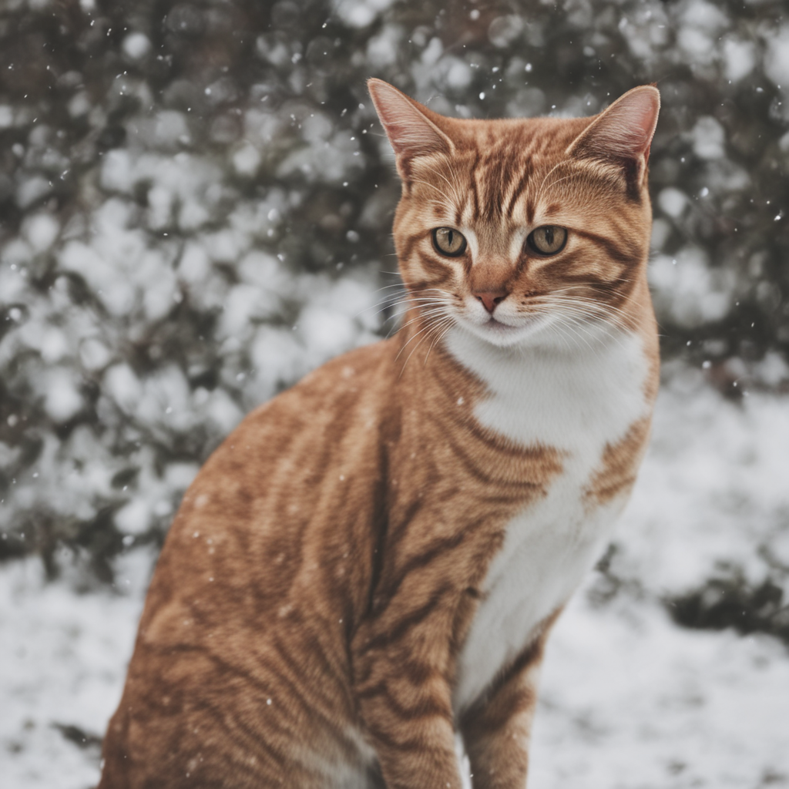
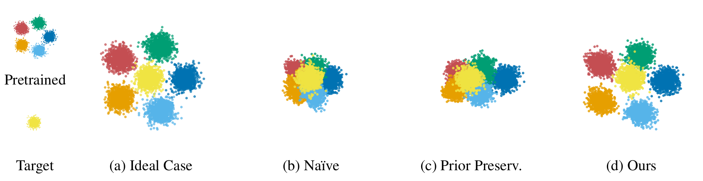

# [ICLR2026] Preserve and Personalize: Personalized Text-to-Image Diffusion Models without Distributional Drift

[Paper](https://openreview.net/forum?id=2ge1Y6DWPw) | [Project Page](https://rlgnswk.github.io/PreserveAndPersonalize_ProjectPage/) | [Poster](https://iclr.cc/virtual/2026/poster/10011710)

## Setup

The repository includes [`environment.yaml`](./environment.yaml), exported from the `pnp` conda environment used for our experiments.

Create the environment with:

```bash
git clone https://github.com/rlgnswk/Preserve-and-Personalize.git
cd Preserve-and-Personalize
conda env create -f environment.yaml
conda activate pnp
```

### Experiment Environment

- Python: `3.8.20`
- PyTorch: `2.4.1+cu118`
- CUDA runtime: `11.8`
- diffusers: `0.33.0.dev0`


## Quick Start

The following example trains SDXL Custom Diffusion on `data/cat` and runs inference with the saved weights.

### Training

```bash
conda activate pnp
cd Preserve-and-Personalize/SDXL
accelerate launch pnp_sdxl_custom_diffusion.py \
  --pretrained_model_name_or_path stabilityai/stable-diffusion-xl-base-1.0 \
  --instance_data_dir ../data/cat \
  --instance_prompt "photo of a <new1> cat" \
  --resolution 512 \
  --train_batch_size 2 \
  --learning_rate 5e-5 \
  --lr_warmup_steps 0 \
  --max_train_steps 250 \
  --gradient_checkpointing \
  --scale_lr \
  --hflip \
  --l2_reg_weight 50 \
  --seed 2025 \
  --modifier_token "<new1>"
```

Data example:

<p align="center">
  
  
  
  
  
</p>

### Inference

```bash
conda activate pnp
cd Preserve-and-Personalize/SDXL
python pnp_sdxl_custom_diffusion_inference.py \
  --weights ./pnp_sdxl_custom_diffusion/unet \
  --prompt "a <new1> cat in the snow" \
  --output_path ./pnp_sdxl_custom_diffusion_inference/cat_in_the_snow.png
```

<p align="center">
  
</p>

## Model Guides

The following guides provide model-specific scripts, hyperparameters, and training/inference examples. The implementations were developed with reference to the [Hugging Face diffusers](https://github.com/huggingface/diffusers/tree/main) library and its example training scripts.

- [SD1.5](./SD1.5/README.md): Full-finetune, Custom Diffusion, and LoRA
- [SDXL](./SDXL/README.md): Custom Diffusion and LoRA
- [SD3](./SD3/README.md): Custom Diffusion and LoRA


## Note on Hyperparameters

The hyperparameters reported in the paper are chosen to work well on average across subjects.
For a specific subject, additional tuning may lead to better results than the default settings reported here.


## Data

The data required for this project can be obtained from
[google/dreambooth](https://github.com/google/dreambooth).

Please download the DreamBooth data from the official repository and place
the downloaded files under `data/` in this repository.

Expected location:

```bash
Preserve-and-Personalize/data/
```

## Toy Experiments

The toy experiments are located in `toy/` and include three variants:

- `toy_naive.py`: naive personalization loss
- `toy_db.py`: prior preservation loss (DreamBooth)
- `toy_ours.py`: our method



Run all three experiments in sequence:

```bash
conda activate pnp
cd Preserve-and-Personalize/toy
python toy_naive.py
python toy_db.py
python toy_ours.py
```
Each script saves its figures in a folder with the same name as the script:

- `toy_naive/`
- `toy_db/`
- `toy_ours/`

The saved figures are:

- `data_distribution.png`
- `target_data.png`
- `pretrained_samples.png`
- `personalized_samples.png`

## BibTeX

```bibtex
@inproceedings{kim2026preserveandpersonalize,
  title     = {Preserve and Personalize: Personalized Text-to-Image Diffusion Models without Distributional Drift},
  author    = {Gihoon Kim and Hyungjin Park and Taesup Kim},
  booktitle = {International Conference on Learning Representations (ICLR)},
  year      = {2026}
}
```
